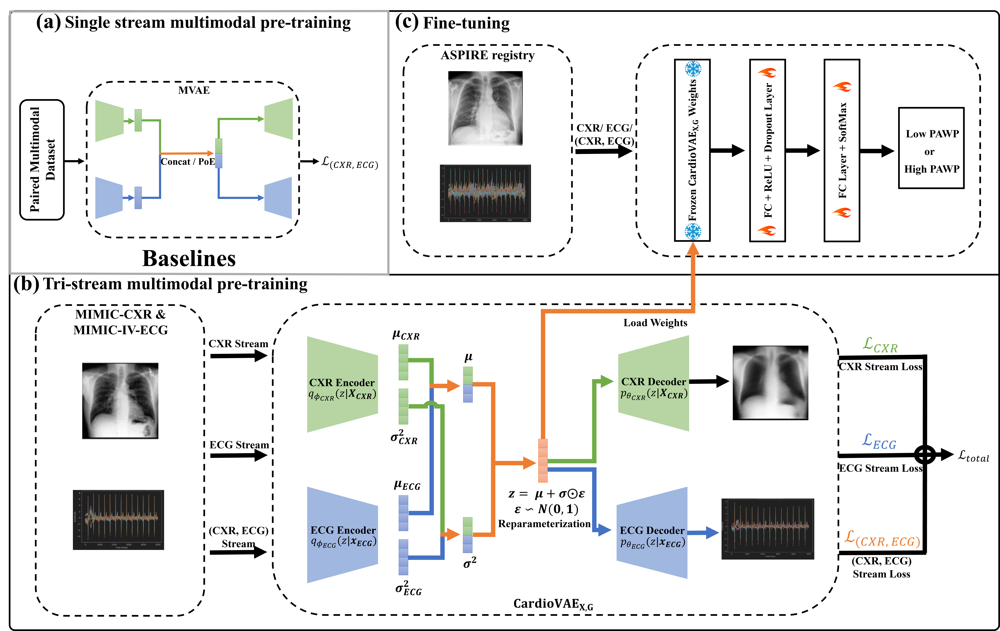

# [Multimodal Variational Autoencoder for Low-cost Cardiac Hemodynamics Instability Detection](https://doi.org/10.48550/arXiv.2403.13658) | MICCAI'24 (Early Accept, Top 11%)

## Introduction
This repository contains the PyTorch implementation of the **CardioVAE<sub>X,G</sub>** framework, as described in our *MICCAI'24* paper "[Multimodal Variational Autoencoder for Low-cost Cardiac Hemodynamics Instability Detection](https://arxiv.org/abs/2403.13658)". **CardioVAE<sub>X,G</sub>** is a multimodal variational autoencoder with a tri-stream pre-training strategy to learn both shared and modality-specific features, thus enabling fine-tuning with both unimodal and multimodal datasets. We pre-trained our **CardioVAE<sub>X,G</sub>** with large unlabeled low-cost chest X-ray (CXR) and electrocardiogram (ECG) modalities from [MIMIC-IV-ECG](https://physionet.org/content/mimic-iv-ecg/1.0/) and [MIMIC-CXR](https://physionet.org/content/mimic-cxr/2.0.0/) and then finetuned it on non-invasive detection of cardiac hemodynamic instability (CHDI) with our in-house dataset from [ASPIRE](https://www.hra.nhs.uk/planning-and-improving-research/application-summaries/research-summaries/aspire-registry/). Comprehensive evaluations against existing methods show that **CardioVAE<sub>X,G</sub>** offers promising performance (AUROC = 0.79 and Accuracy = 0.77), representing a significant step forward in the non-invasive prediction of CHDI.

## Framework


## System Requirements
The source code developed in Python 3.11 using PyTorch 2.0.1. The required python dependencies are given below. **CardioVAE<sub>X,G</sub>** has been pre-trained on an RTX 4090 GPU with 128GB RAM and is supported on any operating system (Windows/macOS/Linux).

```
pytorch>=2.0.1
torchvision>=0.16.2
pydicom>=2.4.4
numpy>=1.24.3
scikit-learn>=0.24.2
matplotlib>=3.7.2
pandas>=2.0.3
pillow>=9.4.0
captum>=0.7.0
```

## Datasets and Pre-trained models
The `datasets` for pre-training can be accessed through PhysioNet. For the [MIMIC-CXR](https://physionet.org/content/mimic-cxr/2.0.0/), you need to become a credentialed user and complete some required training. For MIMIC-IV-ECG, you can find it [here](https://physionet.org/content/mimic-iv-ecg/1.0/).

The in-house ASPIRE dataset contains sensitive patient data which cannot be made public because of the General Data Protection Regulation (GDPR).

The pre-trained model for both pre-trained baselines and **CardioVAE<sub>X,G</sub>** can be found [here](https://drive.google.com/drive/folders/1bGKHCKgdTKWdTw6k5m_lF9BclK_ODUym?usp=sharing).


## Acknowledgements
This implementation is inspired and partially based on earlier work [1].

## References
    [1] Wu, M., Goodman, N.: Multimodal generative models for scalable weaklysupervised learning. Advances in Neural Information Processing Systems 31 (2018)
    [2] Li, L., Camps, J., Wang, Z., Banerjee, A., Rodriguez, B., Grau, V.: Towards enabling cardiac digital twins of myocardial infarction using deep computational models for inverse inference. IEEE Transactions on Medical Imaging (2023)
    [3] Garg, P., Gosling, R., Swoboda, P., Jones, R., Rothman, A., Wild, J.M., Kiely, D.G., Condliffe, R., Alabed, S., Swift, A.J.: Cardiac magnetic resonance identifies raised left ventricular filling pressure: prognostic implications. European Heart Journal 43(26), 2511–2522 (2022)
    [4] Kusunose, K., Hirata, Y., Yamaguchi, N., Kosaka, Y., Tsuji, T., Kotoku, J., Sata, M.: Deep learning approach for analyzing chest X-rays to predict cardiac events in heart failure. Frontiers in Cardiovascular Medicine 10, 1081628 (2023)
